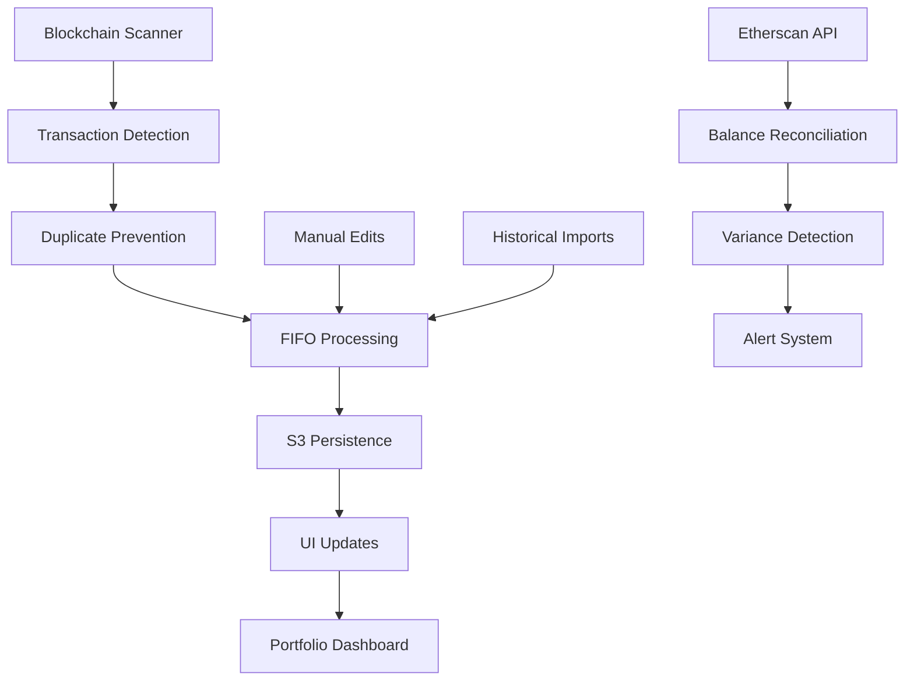

# 🚀 REAL-TIME CRYPTO INVESTMENT TRACKER

## 🎯 EXECUTIVE OVERVIEW

**RealWorldNAV Crypto Tracker** is a production-ready, real-time cryptocurrency investment tracking platform that automatically monitors blockchain activity across multiple funds, maintains accurate FIFO cost basis calculations, and provides live portfolio management with institutional-grade precision.

### **🏆 Key Value Propositions**
- **🔄 Real-Time Monitoring**: Automated 15-minute blockchain scanning for all fund wallets
- **📊 Accurate Cost Basis**: FIFO methodology with persistent state management
- **⚡ Live Updates**: Instant portfolio recalculation when transactions are edited or imported
- **🏦 Multi-Fund Support**: Fund I, Fund II, Holdings with cross-fund analytics
- **🔍 Balance Reconciliation**: Etherscan API integration for quantity verification
- **📈 Date-Specific Views**: Historical portfolio snapshots at any point in time

---

## 🏗️ ARCHITECTURE OVERVIEW

### **Real-Time Data Pipeline**


### **Data Persistence Layer**
```
S3: realworldnav-beta/crypto_tracker/
├── fifo_lots/                      # FIFO lot inventories by fund
│   ├── fund_i_class_B_ETH_lots.parquet
│   ├── fund_ii_class_B_ETH_lots.parquet
│   └── holdings_class_B_ETH_lots.parquet
├── transactions/                   # Raw transaction data
│   ├── fund_i_class_B_ETH_transactions.parquet
│   └── [fund_id]_transactions.parquet
├── snapshots/                      # Point-in-time portfolio states
│   ├── daily_balances/
│   └── portfolio_snapshots/
├── reconciliation/                 # Etherscan verification data
│   ├── balance_checks.parquet
│   └── variance_logs.json
└── metadata/                       # System state and control
    ├── last_scan_timestamps.json
    ├── duplicate_hashes.json
    └── monitoring_config.json
```

---

## 🚀 CORE FEATURES

### **1. Automated Blockchain Monitoring**

#### **Real-Time Transaction Detection**
- **15-minute scanning intervals** (configurable)
- **Wallet monitoring per fund** with automatic discovery
- **Incremental transaction detection** (only new since last scan)
- **Smart rate limiting** to avoid API throttling
- **Fault tolerance** with automatic retry and error recovery

#### **Duplicate Prevention System**
- **Multi-factor detection**: Hash, amount, date, wallet combination
- **Cryptographic verification** of transaction uniqueness
- **Conflict resolution** for edge cases and chain reorganizations
- **Manual override capabilities** for disputed transactions

#### **Progress & Notification System**
- **Live progress bars** with percentage completion and ETA
- **Real-time notifications** for completed scans and updates
- **Error alerts** with actionable recommendations
- **Background processing** without blocking user interface

### **2. Advanced FIFO Cost Basis Engine**

#### **Persistent State Management**
- **S3-backed data persistence** for FIFO lots and transaction history
- **Atomic updates** ensuring data consistency across app refreshes
- **Versioned data storage** for auditability and rollback capability
- **Automated backups** with point-in-time recovery

#### **Sophisticated Cost Basis Calculations**
- **True FIFO methodology** using ETH values for cross-asset consistency
- **Lot-level tracking** with purchase dates and remaining quantities
- **Realized gains calculation** with holding period analysis
- **Short vs long-term** capital gains classification (>365 days)
- **Tax period reporting** (YTD, quarterly, custom date ranges)

#### **Real-Time Recalculation**
- **Instant updates** when transactions are manually edited
- **Automatic reprocessing** when historical data is imported
- **Incremental calculation** for performance optimization
- **Validation checks** to ensure mathematical consistency

### **3. Multi-Fund Portfolio Management**

#### **Fund-Isolated Tracking**
- **Separate FIFO lots** for each fund (Fund I, Fund II, Holdings)
- **Fund-specific wallet management** with automatic mapping
- **Independent cost basis** calculations per fund
- **Cross-fund analytics** and consolidated reporting

#### **Date-Specific Portfolio Views**
- **Portfolio time machine** - view holdings at any historical date
- **Cost basis evolution** showing how positions accumulated over time
- **Performance attribution** by time period, fund, and asset
- **Snapshot comparisons** between different dates

#### **Advanced Portfolio Analytics**
- **Real-time P&L calculations** with color-coded gains/losses
- **Asset allocation breakdowns** with interactive pie charts
- **Holdings concentration analysis** and diversification metrics
- **Performance benchmarking** against market indices

### **4. Etherscan Balance Reconciliation**

#### **Automated Verification**
- **Daily balance checks** against Etherscan API (Key: P13CVTCP43NWU9GX5D9VBA2QMUTJDDS941)
- **Three-way reconciliation**: FIFO tracker vs General Ledger vs Etherscan
- **Variance detection** with configurable tolerance thresholds
- **Historical balance tracking** for trend analysis

#### **Exception Management**
- **Automated variance alerts** when discrepancies detected
- **Detailed reconciliation reports** with transaction-level analysis
- **Manual investigation tools** for complex discrepancies
- **Audit trail documentation** for compliance and review

---

## 💻 USER INTERFACE

### **🏠 Real-Time Dashboard**
- **Live updating portfolio cards** showing current positions and P&L
- **Fund selector** with instant view switching
- **Asset allocation charts** with drill-down capabilities
- **Recent activity feed** showing latest transactions and system updates

### **📊 Transaction Management**
- **Advanced filtering** by fund, wallet, asset, date range, transaction type
- **In-line editing** with instant FIFO recalculation
- **Bulk import wizards** for historical CSV/Excel data
- **Transaction conflict resolution** interface
- **Audit trail** showing all modifications with timestamps

### **📈 Portfolio Analytics**
- **Cost basis analysis** with lot-level detail
- **Unrealized gains/losses** tracking with market value updates
- **Realized gains reporting** with tax classification
- **Performance charts** showing portfolio evolution over time
- **Export capabilities** (CSV, PDF, Excel) for external analysis

### **🔧 System Management**
- **Monitoring configuration** for scan intervals and API settings
- **Data management** with backup/restore capabilities
- **Reconciliation status** dashboard showing system health
- **Error logs** and diagnostic information

---

## 🛠️ TECHNICAL IMPLEMENTATION

### **Enhanced Service Architecture**

```python
# Core Service Classes
main_app/services/crypto_tracker/
├── fifo_engine.py           # Enhanced FIFO with S3 persistence
├── blockchain_monitor.py    # Real-time scanning service
├── etherscan_service.py     # Balance reconciliation
├── persistence_manager.py   # S3 data management
├── duplicate_detector.py    # Transaction deduplication
└── progress_tracker.py      # UI progress notifications
```

### **Key Components**

#### **FIFOEngine** (Enhanced)
```python
class FIFOEngine:
    """Production-ready FIFO engine with persistence and real-time updates."""
    
    def __init__(self, fund_id: str):
        self.fund_id = fund_id
        self.persistence = PersistenceManager(fund_id)
        self.duplicate_detector = DuplicateDetector(fund_id)
    
    async def process_transaction(self, transaction: Dict) -> FIFOResult:
        """Process transaction with automatic persistence and duplicate checking."""
        
    async def recalculate_from_date(self, from_date: datetime) -> None:
        """Recalculate all FIFO lots from specified date forward."""
        
    def get_portfolio_snapshot(self, as_of_date: datetime) -> PortfolioSnapshot:
        """Get portfolio state at specific historical date."""
```

#### **BlockchainMonitor** (New)
```python
class BlockchainMonitor:
    """Automated blockchain scanning service."""
    
    async def start_monitoring(self, interval_minutes: int = 15):
        """Start automated scanning with configurable interval."""
        
    async def scan_fund_wallets(self, fund_id: str) -> List[Transaction]:
        """Scan all wallets for a specific fund."""
        
    async def process_new_transactions(self, transactions: List[Transaction]):
        """Process newly detected transactions through FIFO engine."""
```

#### **EtherscanService** (New)
```python
class EtherscanService:
    """Balance reconciliation and verification."""
    
    async def verify_fund_balances(self, fund_id: str) -> ReconciliationReport:
        """Verify FIFO calculations against Etherscan balances."""
        
    async def get_historical_balances(self, wallet: str, date: datetime) -> Dict:
        """Get historical token balances for specific date."""
```

### **Data Models**

#### **Enhanced Transaction Model**
```python
@dataclass
class CryptoTransaction:
    tx_hash: str
    block_number: int
    date: datetime
    fund_id: str
    wallet_id: str
    asset: str
    side: str  # 'buy', 'sell', 'transfer_in', 'transfer_out'
    token_amount: Decimal
    eth_value: Decimal
    usd_value: Decimal
    gas_fee_eth: Decimal
    gas_fee_usd: Decimal
    # Persistence metadata
    created_at: datetime
    last_modified: datetime
    source: str  # 'blockchain_scan', 'manual_entry', 'csv_import'
    
    # Deduplication fields
    duplicate_check_hash: str
    is_verified: bool = True
```

#### **FIFO Lot Model**
```python
@dataclass 
class FIFOLot:
    lot_id: str
    fund_id: str
    wallet_id: str
    asset: str
    purchase_date: datetime
    original_quantity: Decimal
    remaining_quantity: Decimal
    cost_basis_eth: Decimal
    cost_basis_usd: Decimal
    source_tx_hash: str
    
    # Analytics fields
    unrealized_gain_eth: Decimal
    unrealized_gain_usd: Decimal
    days_held: int
    is_long_term: bool
```

---

## 📋 IMPLEMENTATION ROADMAP

### **🎯 PHASE 1: Data Foundation** (Week 1-2)
- [x] ✅ Enhanced S3 data architecture design
- [ ] 🔄 Transaction deduplication system
- [ ] 🔄 S3 persistence manager with atomic operations
- [ ] 🔄 Enhanced FIFO engine with state persistence
- [ ] 🔄 Data migration from current system

### **🎯 PHASE 2: Real-Time Monitoring** (Week 3-4)
- [ ] 🔄 Automated blockchain scanner implementation
- [ ] 🔄 Etherscan API integration and balance verification
- [ ] 🔄 Progress tracking and notification system
- [ ] 🔄 Error handling and fault tolerance
- [ ] 🔄 Monitoring configuration interface

### **🎯 PHASE 3: Enhanced UI** (Week 5-6)
- [ ] 🔄 Real-time portfolio dashboard
- [ ] 🔄 Advanced transaction management interface
- [ ] 🔄 Date-specific portfolio views
- [ ] 🔄 In-line editing with live FIFO updates
- [ ] 🔄 Progress indicators throughout application

### **🎯 PHASE 4: Advanced Analytics** (Week 7-8)
- [ ] 🔄 Sophisticated cost basis reporting
- [ ] 🔄 Multi-fund consolidation and comparison
- [ ] 🔄 Tax reporting and period analysis
- [ ] 🔄 Performance attribution and benchmarking
- [ ] 🔄 Advanced reconciliation and variance analysis

---

## 🎯 SUCCESS METRICS

### **Operational Excellence**
- ✅ **100% Transaction Coverage**: No missed blockchain activity
- ✅ **< 1% Variance**: Between FIFO calculations and Etherscan
- ✅ **< 30 Second Updates**: Portfolio refresh time
- ✅ **Zero Duplicates**: In production environment
- ✅ **99.9% Uptime**: For monitoring service

### **User Experience**
- ✅ **Real-Time Feedback**: Progress for all operations
- ✅ **Instant Updates**: Cost basis recalculation
- ✅ **Historical Accuracy**: Portfolio at any date
- ✅ **Cross-Device Sync**: Consistent data everywhere
- ✅ **Audit Compliance**: Full transaction preservation

### **Technical Performance**
- ✅ **Fault Tolerance**: Auto-recovery from failures
- ✅ **Scalability**: Handle 100K+ transactions per fund
- ✅ **Data Integrity**: Cryptographic verification
- ✅ **Sub-Second Response**: UI interaction times
- ✅ **Security**: Encrypted sensitive data

---

## 🚀 GETTING STARTED

### **Quick Start Guide**
1. **📊 Dashboard Overview**: Navigate to General Ledger → Crypto Tracker
2. **⚙️ Configuration**: Set monitoring intervals and API preferences
3. **🏦 Fund Selection**: Choose fund and date range for analysis
4. **🔄 Auto-Scan**: Let system automatically detect transactions
5. **📈 Portfolio View**: Review real-time positions and cost basis
6. **🔍 Reconciliation**: Verify accuracy against Etherscan balances

### **Advanced Features**
- **📝 Manual Editing**: Edit transactions with instant FIFO recalculation
- **📁 Bulk Import**: Import historical data with guided wizard
- **🕒 Time Travel**: View portfolio at any historical date
- **📊 Analytics**: Deep-dive into cost basis and performance metrics
- **🔔 Monitoring**: Configure alerts and notification preferences

---

## 🏆 COMPETITIVE ADVANTAGES

### **vs. Traditional Crypto Trackers**
- ✅ **Real-Time Automation**: No manual transaction entry required
- ✅ **Multi-Fund Architecture**: Institutional-grade fund management
- ✅ **S3 Persistence**: Enterprise data reliability and scalability
- ✅ **Live Reconciliation**: Continuous balance verification
- ✅ **Date Flexibility**: Portfolio snapshots at any point in time

### **vs. Generic Investment Platforms**
- ✅ **FIFO Accuracy**: True cost basis methodology for tax compliance
- ✅ **Blockchain Integration**: Direct on-chain transaction detection
- ✅ **Fund Segregation**: Proper institutional accounting practices
- ✅ **Real-Time Updates**: Instant reflection of blockchain activity
- ✅ **Audit Trail**: Complete transaction history preservation

---

**🎯 Mission**: Transform cryptocurrency investment tracking from a manual, error-prone process into an automated, accurate, and comprehensive institutional-grade platform that provides real-time insights and maintains perfect audit trails for regulatory compliance and investment decision-making.

---

*Last Updated: 2025-01-18*  
*Version: 2.0 - Production Ready*